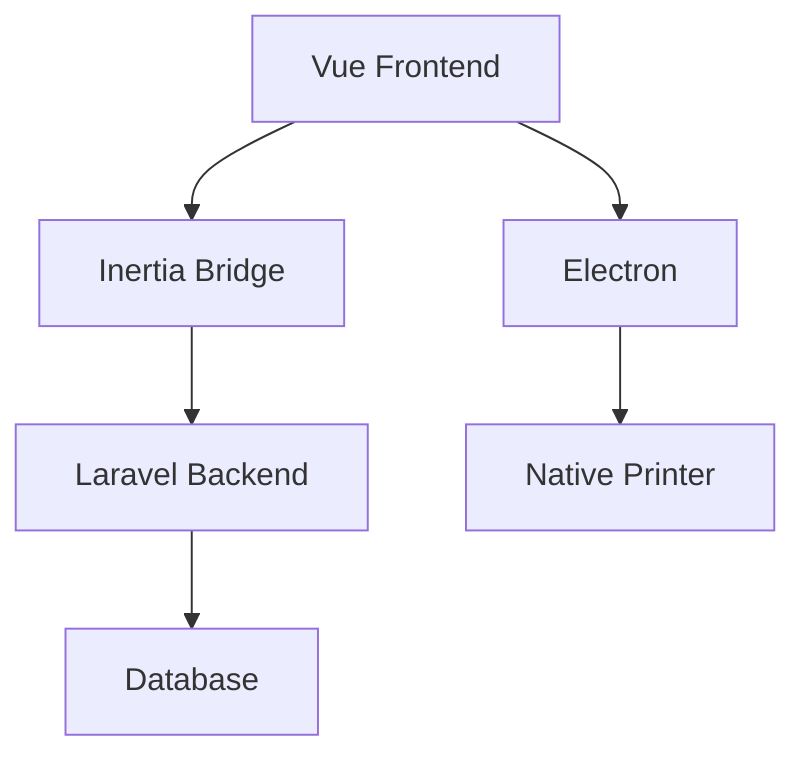

# Automated Label Generator - Technical Documentation

## Table of Contents
1. [Architecture Overview](#architecture-overview)
2. [Core Features](#core-features)
3. [Implementation Details](#implementation-details)
4. [Testing Guide](#testing-guide)
5. [Security & Performance](#security--performance)

## Architecture Overview

### Tech Stack
- Frontend: Vue 3 + Inertia.js
- Backend: Laravel
- Database: MySQL/PostgreSQL
- UI: TailwindCSS + Lucide Icons

### System Architecture


## Core Features

### 1. Label Generation System

#### Order Kecil (Small Orders)
Reference implementation:
```resources/js/Pages/OrderKecil/CetakLabel.vue
startLine: 25
endLine: 38
```

Key features:
- Automatic rim calculation
- Label quantity optimization
- Real-time validation
- Color-coded OBC series

#### Order Besar (Large Orders)
Reference implementation:
```resources/js/Pages/OrderBesar/CetakLabel.vue
startLine: 497
endLine: 507
```

Features:
- INS handling
- Side marking (Kiri/Kanan)
- Verification tracking

### 2. Print System

#### Label Template Generation
```javascript
export function generateLabel(data) {
    const {obc, noRim, color, sisiran, periksa1, periksa2} = data;
    
    return `
        <div class="label" style="color: ${color}">
            <div class="header">${obc}</div>
            <div class="content">
                <div class="rim">${noRim}</div>
                <div class="verification">
                    ${periksa1}${periksa2 ? `/${periksa2}` : ''}
                </div>
                <div class="side-mark">${sisiran || ''}</div>
            </div>
        </div>
    `;
}
```

#### Print Service Integration
Reference implementation:
```php:app/Http/Controllers/OrderBesar/CetakLabelController.php
startLine: 84
endLine: 92
```

### 3. Production Monitoring

#### Status Tracking
Status codes:
- 0: Belum Verifikasi
- 1: Proses Verifikasi
- 2: Selesai Verifikasi

#### Real-time Updates
```javascript
const monitorStatus = async () => {
    try {
        const response = await axios.get(`/api/status/${orderId}`);
        updateStatusDisplay(response.data);
    } catch (error) {
        handleError(error);
    }
};
```

## Implementation Details

### Controllers

#### OrderKecilController
Reference implementation:
```php:app/Http/Controllers/OrderKecil/CetakLabelController.php
startLine: 83
endLine: 100
```

Key responsibilities:
- Order validation
- Label generation
- Status management
- Error handling

#### OrderBesarController
Features:
- Transaction management
- Progress tracking
- Service integration
- Response handling

### Services

#### PrintLabelService
```php
class PrintLabelService
{
    public function createLabel(
        string $po,
        int $noRim,
        string $potongan,
        string $periksa1,
        ?string $periksa2,
        int $team
    ): void {
        // Implementation
    }

    public function populateLabelForRegisteredPo(array $data): void {
        // Implementation
    }
}
```

#### ProductionOrderService
```php
class ProductionOrderService
{
    public function isPoFinished(string $po): bool {
        // Implementation
    }

    public function registerProductionOrder(array $data): void {
        // Implementation
    }
}
```

### Vue Components

#### CetakLabel Component
Key features:
- Form handling with useForm
- Debounced API calls
- Print preview
- Error handling

Reference implementation:
```resources/js/Pages/OrderKecil/CetakLabel.vue
startLine: 61
endLine: 75
```

#### Loading States
Reference implementation:
```resources/js/Pages/OrderKecil/CetakLabel.vue
startLine: 199
endLine: 208
```

## Testing Guide

### Feature Tests
Reference implementation:
```php:tests/Feature/CetakLabelOrderBesarTest.php
startLine: 89
endLine: 124
```

Test coverage:
- Label generation
- Order processing
- Status updates
- Error scenarios

### Unit Tests
```php
class PrintLabelServiceTest extends TestCase
{
    /** @test */
    public function it_creates_label_correctly(): void
    {
        // Test implementation
    }

    /** @test */
    public function it_handles_invalid_input(): void
    {
        // Test implementation
    }
}
```

## Security & Performance

### Security Measures
1. Input Validation
```php
protected $rules = [
    'po' => ['required', 'string', 'regex:/^\d{10}$/'],
    'obc' => ['required', 'string', 'regex:/^[A-Z0-9]{9}$/'],
    'team' => ['required', 'integer', 'exists:workstations,id'],
];
```

2. Transaction Management
```php
DB::transaction(function () use ($data) {
    // Atomic operations
});
```

### Performance Optimizations

1. Debounced API Calls
Reference implementation:
```resources/js/Pages/OrderKecil/CetakLabel.vue
startLine: 67
endLine: 73
```

2. Batch Processing
```php
public function processBatch(array $labels): void
{
    collect($labels)
        ->chunk(100)
        ->each(fn($chunk) => $this->processLabelChunk($chunk));
}
```

## API Documentation

### Label Generation
```http
POST /api/order-kecil/cetak-label
Content-Type: application/json

{
    "po": "string",
    "obc": "string",
    "team": "number",
    "periksa1": "string",
    "periksa2": "string"
}
```

### Status Updates
```http
GET /api/status/{orderId}
Authorization: Bearer {token}

Response: {
    "status": "number",
    "progress": "number",
    "verification": {
        "periksa1": "string",
        "periksa2": "string"
    }
}
```


```markdown:docs/TECHNICAL.md
## Advanced Features & Customization

### Print Template System

#### Base Template Structure
```javascript:resources/js/Components/PrintPages/PrintLabel.js
export function labelPage(
    obc,
    noRim = "",
    color,
    sisiran = "",
    periksa1,
    periksa2 = ""
) {
    let date = new Date();
    const months = ["Jan", "Feb", "Mar", "Apr", "Mei", "Jun", "Jul", "Agu", "Sep", "Okt", "Nov", "Des"];
    let tgl = `${date.getDate()}-${months[date.getMonth()]}-${date.getFullYear()}`;
    let time = `${date.getHours()} : ${date.getMinutes()}`;

    return `<!DOCTYPE html>
        <html>
            <head></head>
            <body>
                <div style='page-break-after:avoid; width:100%; height:fit-content;'>
                    <div style="margin-top:19.5vh; margin-left:18.5vh">
                        <span style="font-weight:600; text-align:center;">${tgl}</span>
                        <h1 style="font-size: 24px; line-height: 32px; margin-left:25px; font-weight:600; text-align:center; display:inline-block; padding-top:6px; color:${color}">${obc}</h1>
                    </div>
                    <!-- Additional template structure -->
                </div>
            </body>
        </html>`;
}
```

#### Batch Print Implementation
```javascript:resources/js/Components/PrintPages/PrintLabel.js
export function batchLabelPage(
    obc,
    noRim,
    color,
    sisiran,
    periksa1,
    periksa2,
    jml_label
) {
    let labels = '';
    for (let i = 0; i < jml_label; i++) {
        labels += labelPage(obc, noRim, color, sisiran, periksa1, periksa2);
    }
    return labels;
}
```

### Order Processing System

#### Order Kecil Implementation
```vue:resources/js/Pages/OrderKecil/CetakLabel.vue
<script setup>
const form = useForm({
    team: props.currentTeam,
    po: "",
    obc: "",
    start_rim: 1,
    end_rim: 1,
    produk: "PCHT",
    jml_lembar: "",
    jml_label: "",
    seri: "",
    periksa1: "",
    periksa2: "",
    jml_rim: "",
});

// Fetch specification data
const fetchData = () => {
    errorPo.value = "";
    isLoading.value = true;
    
    axios.get(`/api/order-kecil/fetch-spec/${form.po}`)
        .then((res) => {
            let total_label = Math.ceil(res.data.rencet / 500);
            form.obc = res.data.no_obc;
            form.jml_rim = `${res.data.rencet} / ${total_label} Rim`;
            // Additional processing
        })
        .catch(() => {
            errorPo.value = "Nomor PO Tidak Ditemukan";
        })
        .finally(() => {
            isLoading.value = false;
        });
};
</script>
```

#### Order Besar Implementation
```vue:resources/js/Pages/OrderBesar/CetakLabel.vue
<script setup>
const form = useForm({
    id: props.product.id,
    po: props.product.no_po,
    obc: props.product.no_obc,
    team: props.crntTeam,
    seri: computedSeri.value,
    jml_rim: 1,
    lbr_ptg: props.potongan,
    no_rim: props.noRim,
    periksa1: "",
    date: props.date,
});

// Handle form submission
const submit = () => {
    form.post(route('order-besar.store'), {
        onSuccess: () => {
            // Handle success
        },
        onError: () => {
            // Handle error
        }
    });
};
</script>
```

### Database Schema & Models

#### Production Orders
```php:database/migrations/create_production_orders_table.php
Schema::create('production_orders', function (Blueprint $table) {
    $table->id();
    $table->string('no_po', 10);
    $table->string('no_obc', 9);
    $table->enum('type', ['besar', 'kecil']);
    $table->integer('total_rim');
    $table->integer('status')->default(0);
    $table->timestamps();
    $table->index(['no_po', 'no_obc']);
});
```

#### Generated Labels
```php:database/migrations/create_generated_labels_table.php
Schema::create('generated_labels', function (Blueprint $table) {
    $table->id();
    $table->foreignId('production_order_id')->constrained();
    $table->integer('no_rim');
    $table->enum('potongan', ['Kiri', 'Kanan']);
    $table->string('np_users', 4);
    $table->timestamp('verified_at')->nullable();
    $table->timestamps();
});
```

### Error Handling & Validation

#### Request Validation
```php:app/Http/Requests/StoreGeneratedProductsRequest.php
class StoreGeneratedProductsRequest extends FormRequest
{
    public function rules(): array
    {
        return [
            'po' => ['required', 'string', 'size:10'],
            'obc' => ['required', 'string', 'size:9'],
            'team' => ['required', 'integer', 'exists:workstations,id'],
            'seri' => ['required', 'integer', 'between:1,3'],
            'jml_rim' => ['required', 'integer', 'min:1'],
            'lbr_ptg' => ['required', 'in:Kiri,Kanan'],
            'periksa1' => ['required', 'string', 'size:4'],
        ];
    }
}
```

#### Error Handling Middleware
```php:app/Http/Middleware/HandlePrintErrors.php
class HandlePrintErrors
{
    public function handle($request, Closure $next)
    {
        try {
            return $next($request);
        } catch (PrinterException $e) {
            return response()->json([
                'error' => 'Printer error occurred',
                'message' => $e->getMessage()
            ], 500);
        } catch (Exception $e) {
            return response()->json([
                'error' => 'An unexpected error occurred',
                'message' => $e->getMessage()
            ], 500);
        }
    }
}
```

### Testing Strategies

#### Feature Tests
```php:tests/Feature/CetakLabelOrderBesarTest.php
class CetakLabelOrderBesarTest extends TestCase
{
    use DatabaseTransactions;

    public function test_can_cetak_label_for_order_besar(): void
    {
        $user = $this->createTestUser();
        $this->createTestSpecification();
        
        $requestData = [
            'po' => "4000000001",
            'obc' => 'TST010110',
            'team' => 1,
            // Additional test data
        ];

        $response = $this->actingAs($user)
            ->postJson('/api/order-besar/cetak-label', $requestData);

        $response->assertStatus(200);
        
        $this->assertDatabaseHas('generated_labels', [
            'no_po_generated_products' => $requestData['po'],
            'no_rim' => $requestData['no_rim'],
            // Additional assertions
        ]);
    }
}
```

### Performance Optimization

#### Query Optimization
```php:app/Services/ProductionOrderService.php
class ProductionOrderService
{
    public function getProductionOrderStatus(string $po): array
    {
        return GeneratedLabels::select([
            'status',
            DB::raw('COUNT(*) as count')
        ])
        ->where('no_po', $po)
        ->groupBy('status')
        ->get()
        ->pluck('count', 'status')
        ->toArray();
    }
}
```

#### Caching Strategy
```php:app/Services/CacheService.php
class CacheService
{
    public function getCachedOrderStatus(string $po): array
    {
        return Cache::remember(
            "order_status_{$po}",
            now()->addMinutes(5),
            fn() => $this->productionOrderService->getProductionOrderStatus($po)
        );
    }
}
```

## Deployment Guide

### Production Setup
```bash
# Build frontend assets
npm run build

# Optimize Laravel
php artisan optimize
php artisan config:cache
php artisan route:cache
php artisan view:cache

# Build Electron app
npm run electron:build
```

### Environment Configuration
```env
# Production environment settings
APP_ENV=production
APP_DEBUG=false
QUEUE_CONNECTION=redis
CACHE_DRIVER=redis
SESSION_DRIVER=redis

# Printer settings
PRINTER_DEFAULT_FORMAT=A5
PRINTER_MARGIN_TOP=10
PRINTER_MARGIN_LEFT=20
```
